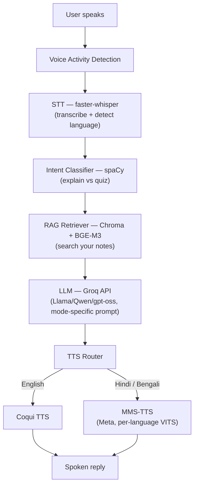

# Echo — Multilingual Study Voice Assistant

Echo is a voice-based AI study assistant that explains topics and generates quizzes,
grounded in your own notes, in **English, Hindi, and Bengali** — built entirely on
free and open-source tools.

Ask a question out loud → Echo transcribes it, figures out if you want an
explanation or a quiz, looks up relevant content from your uploaded notes, generates
a grounded answer, and speaks the reply back in your language.

---

## Features

-  **Voice in, voice out** — speak your question, hear the answer
-  **Multilingual** — English, Hindi, Bengali (auto-detected or manually selected)
- **Two modes** — *Explainer* (step-by-step breakdowns) and *Quiz generator* (MCQs, short answers)
-  **Grounded answers (RAG)** — retrieves relevant chunks from your own notes before answering, rather than relying purely on the LLM's general knowledge
-  **Local intent routing** — a lightweight spaCy classifier decides explain-vs-quiz without an API call
-  **100% free stack** — no paid APIs, no local GPU required

---

## Architecture



**Flow in words:**

1. **Speech in** → captured via microphone (web UI) or an audio file
2. **STT (faster-whisper)** → transcribes speech to text and detects the spoken language, with a manual override available if auto-detection gets Hindi/Bengali confused
3. **Intent classification (spaCy)** → decides whether the student wants an *explanation* or a *quiz*, using lightweight keyword/pattern matching — fast, local, no API call
4. **RAG retrieval (Chroma + BGE-M3 embeddings)** → searches the student's own uploaded notes for the most relevant chunks, filtered by a cosine-distance threshold so irrelevant content is dropped rather than always returning a fixed count
5. **LLM generation (Groq API)** → the retrieved context, the detected/selected language, and a mode-specific system prompt (explainer or quiz) are sent to a free hosted LLM, which generates a grounded, speech-friendly response in the student's language
6. **TTS (Coqui / MMS-TTS)** → the reply is routed to the right voice engine based on language and spoken back

---

## Tech Stack

| Layer | Technology | Why |
|---|---|---|
| STT | [faster-whisper](https://github.com/SYSTRAN/faster-whisper) | Fast, local, multilingual transcription |
| Intent classification | [spaCy](https://spacy.io/) | Lightweight, local, no API cost |
| RAG / Knowledge base | [ChromaDB](https://www.trychroma.com/) + [BGE-M3](https://huggingface.co/BAAI/bge-m3) | Local vector search, strong cross-lingual retrieval |
| LLM | [Groq API](https://console.groq.com) (free tier) | Fast, free-tier hosted inference for strong open models |
| TTS (English) | [Coqui TTS](https://github.com/coqui-ai/TTS) | Open-source, local synthesis |
| TTS (Hindi/Bengali) | [MMS-TTS](https://huggingface.co/facebook/mms-tts-hin) (Meta) | Ungated, per-language checkpoints for Indian languages |
| UI | [Gradio](https://www.gradio.app/) | Quick, browser-based voice interface |

---

##  Project Structure

```
voice-agent/
├── config.py              # Central config: models, prompts, RAG settings
├── logger.py               # Centralized logging
├── main.py                 # File-based CLI test loop
├── web_ui/app.py            # Gradio web interface (primary demo entry point)
│
├── stt/whisper_stt.py       # Speech-to-text
├── nlu/intent_classifier.py # Explain vs quiz routing
├── rag/
│   ├── knowledge_base.py    # Ingests data/notes/*.txt into Chroma
│   └── retriever.py         # Relevance-filtered retrieval
├── llm/
│   ├── groq_client.py       # Groq API wrapper
│   └── dialogue_manager.py  # Ties intent + RAG + LLM together
├── tts/
│   ├── coqui_tts.py
│   ├── mms_tts.py
│   └── tts_router.py        # Routes by language, with fallback
│
└── data/
    ├── notes/                # Your .txt study notes (add your own here)
    └── chroma_db/             # Auto-generated vector store
```

---

## Setup

### 1. Clone and install
```bash
git clone <your-repo-url>
cd voice-agent
pip install -r requirements.txt
python -m spacy download en_core_web_sm
```

### 2. Configure your free API key
```bash
cp .env.example .env
```
Add a free Groq API key (get one at [console.groq.com](https://console.groq.com)):
```
GROQ_API_KEY=your_key_here
GROQ_MODEL=openai/gpt-oss-120b
```

### 3. Add your study notes
Drop `.txt` files into `data/notes/`, then build the knowledge base:
```bash
python -m rag.knowledge_base
```

### 4. Run
```bash
python web_ui/app.py
```
Open the local URL it prints (e.g. `http://127.0.0.1:7860`).

---

Example Usage

- *"Explain Newton's second law with an example"* → explainer mode, grounded in your notes
- *"Give me 3 MCQs on photosynthesis"* → quiz mode, grounded in your notes
- *"न्यूटन का नियम समझाओ"* → same, in Hindi
- *"ফটোসিন্থেসিস নিয়ে ৩টা প্রশ্ন দাও"* → same, in Bengali

---

##  Known Limitations

- **Hindi/Bengali auto-detection** can occasionally confuse the two languages on short audio clips, since they share phonetic and lexical similarities. A manual language override dropdown is provided in the UI as a mitigation.
- **Bengali STT accuracy** on the `medium` Whisper model is noticeably weaker than English/Hindi; a manual language override forces the correct decoding language token but doesn't fully guarantee accurate script output. Swapping to an Indic-specific STT model (e.g. AI4Bharat's IndicConformer) would be the proper long-term fix — identified but not implemented, due to project time constraints.
- **English TTS uses a general (American-accented) voice.** Indian-accented English TTS (MeloTTS) was evaluated but reverted after it introduced a dependency conflict with other pipeline components; prioritized system stability over this enhancement given the deadline.
- **Free-tier hosted models can be deprecated** on the provider's schedule — the LLM model in use has already been swapped once mid-project after Groq deprecated the original model. `config.py` centralizes the model name for easy swapping if this happens again.
- **No phone-call (telephony/SIP) reachability** — deliberately out of scope, as it requires a paid SIP trunk/phone number and public server infrastructure beyond the free-resource constraint of this project.

---

##  Future Work

- Swap to an Indic-specific STT model for better Hindi/Bengali accuracy
- Indian-accented English TTS, integrated without dependency conflicts
- Additional language support (Punjabi, Marathi, Malayalam — groundwork already in place in the config/routing layer)
- Real-time streaming pipeline (mic in, continuous conversation, barge-in support)
- Custom voice fine-tuning on self-recorded data

---

##  License

Built for educational/internship purposes using free and open-source components only.
